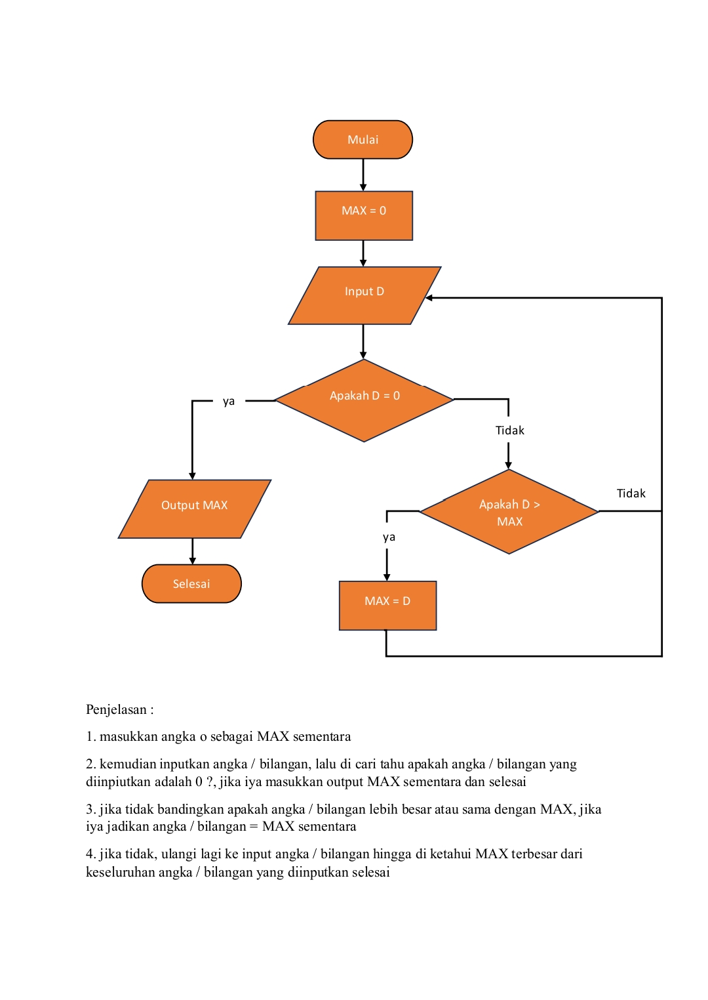
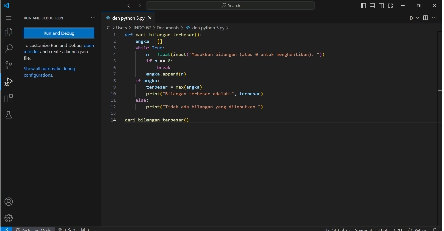
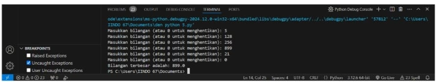

# pratikum3
Nama : Muhamad Rizki Wahyu Saputra 

Nim : 312410534 

Kelas : TI 24.A5 

Mata kuliah : Bahasa Pemograman  

## menentukan bilangan terbesar dari N bilangan yang di inputkan
### Flowchart

### program python

### Hasil eksekusi program

